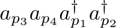
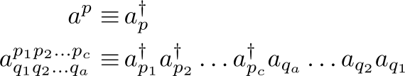
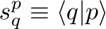

SeQuant: second quantization toolkit in C++
===========================================

# Synopsis

`SeQuant` is a framework for performing symbolic algebra designed specifically
for the algebra of second quantization in quantum many-body physics.
More abstractly it can symbolically transform and numerically
evaluate (with an appropriate external tensor backend) general
tensor algebra expressions.

# Installation

See file INSTALL.md .

# Getting started

## Build harness
To use SeQuant from within an existing codebase that has a CMake harness (the only case considered here) it should be sufficient to do this:
```cmake
find_package(SeQuant CONFIG REQUIRED)
target_link_libraries(your_executable_or_library_target PUBLIC SeQuant::SeQuant)
```
It is often desirable to build SeQuant from source within a standalone codebase; this case be done using the FetchContent CMake module as follows:
```cmake
find_package(SeQuant CONFIG)
if (NOT TARGET SeQuant::SeQuant)
    cmake_minimum_required(VERSION 3.14.0)  # for FetchContent_MakeAvailable
    include(FetchContent)
    FetchContent_Declare(sequant
            GIT_REPOSITORY      https://github.com/ValeevGroup/SeQuant2.git
            )
    FetchContent_MakeAvailable(sequant)
endif()
target_link_libraries(your_executable_or_library_target PUBLIC SeQuant::SeQuant)
```

## Using

To get started let's use SeQuant to apply Wick's theorem to a simple product of elementary (creation and annihilation)
 fermionic operators:

 ,

This is achieved by the following SeQuant program:

```c++
#include <SeQuant/core/sequant.hpp>
#include <SeQuant/core/op.hpp>
#include <SeQuant/core/wick.hpp>

int main() {
  using namespace sequant;

  IndexSpace sp;
  Index p1(L"p_1", sp), p2(L"p_2", sp), p3(L"p_3", sp), p4(L"p_4", sp);

  auto cp1 = fcrex(p1), cp2 = fcrex(p2);
  auto ap3 = fannx(p3), ap4 = fannx(p4);

  std::wcout << to_latex(ap3 * ap4 * cp1 * cp2) << " = "
             << to_latex(FWickTheorem{ap3 * ap4 * cp1 * cp2}
                             .set_external_indices(std::array{p1, p2, p3, p4})
                             .full_contractions(false)
                             .compute())
             << std::endl;
  
  return 0;
}
```

Running this program should produce a LaTeX expression for this formula:

 ,

where the tensor notation is used to denote elementary and composite _normal_ operators,

 ,

and



denote 1-particle state inner products (overlaps). Wick's theorem can of course be applied to directly to products of normal composite operators, e.g,

```c++
  auto nop1 = ex<FNOperator>(std::array{p1, p2}, std::array{p3, p4});
  auto nop2 = ex<FNOperator>(std::array{p5}, std::array{p6, p7});

  std::wcout << to_latex(nop1 * nop2) << " = "
             << to_latex(FWickTheorem{nop1 * nop2}
                             .set_external_indices(
                                 std::array{p1, p2, p3, p4, p5, p6, p7})
                             .full_contractions(false)
                             .compute())
             << std::endl;
```

produces

 .

where `␣` is used in number-nonconserving operators to point out the empty "slots":

Of course, same functionality can be used for bosons:

![{{b^{{p_1}{p_2}}_{{p_3}{p_4}}}{b^{{p_5}{p_6}}_{\textvisiblespace\,{p_7}}}} = { \bigl({b^{{p_5}{p_1}{p_2}{p_6}}_{\textvisiblespace\,{p_3}{p_4}{p_7}}} + {{s^{{p_6}}_{{p_3}}}{b^{{p_5}{p_2}{p_1}}_{\textvisiblespace\,{p_4}{p_7}}}} + {{s^{{p_5}}_{{p_3}}}{b^{{p_1}{p_2}{p_6}}_{\textvisiblespace\,{p_4}{p_7}}}} + {{s^{{p_6}}_{{p_4}}}{b^{{p_5}{p_1}{p_2}}_{\textvisiblespace\,{p_3}{p_7}}}} + {{s^{{p_5}}_{{p_4}}}{b^{{p_2}{p_1}{p_6}}_{\textvisiblespace\,{p_3}{p_7}}}} + {{s^{{p_5}}_{{p_3}}}{s^{{p_6}}_{{p_4}}}{b^{{p_1}{p_2}}_{\textvisiblespace\,{p_7}}}} + {{s^{{p_6}}_{{p_3}}}{s^{{p_5}}_{{p_4}}}{b^{{p_2}{p_1}}_{\textvisiblespace\,{p_7}}}}\bigr) }](doc/images/tut-expr3-result1.svg) ,

where `b` denotes normal bosonic operators constructed analogously with the normal fermionic operators `a`, is obtained via

```c++
  auto nop3 = ex<BNOperator>(std::array{p1, p2}, std::array{p3, p4});
  auto nop4 = ex<BNOperator>(std::array{p5, p6}, std::array{p7});

  std::wcout << to_latex(nop3 * nop4) << " = "
             << to_latex(BWickTheorem{nop3 * nop4}
                             .set_external_indices(
                                 std::array{p1, p2, p3, p4, p5, p6, p7})
                             .full_contractions(false)
                             .compute())
             << std::endl;
```

# Developers

`SeQuant` is developed by the Valeev group at Virginia Tech.
